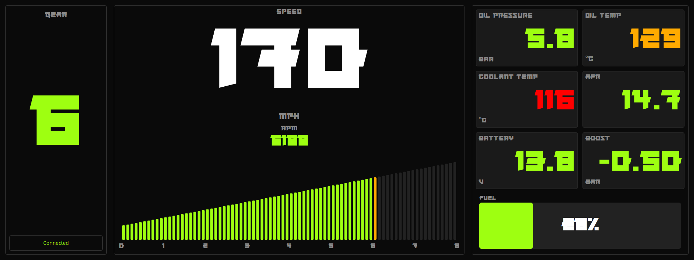

# RoboDash

[](LICENSE)
[](https://www.python.org/)
[](https://www.riverbankcomputing.com/software/pyqt/)



A custom racing car dashboard for a Toyota Supra Mk4, designed as part of an NEA coursework. Features a PyQt5-based display system running on Raspberry Pi with ECUMaster EMU Black CAN bus integration.

Reference implementation based on [DIY-Emu-Black-Dash](https://github.com/valtsu23/DIY-Emu-Black-Dash).

## Table of Contents

- [Features](#features)
- [Quick Start](#quick-start)
- [Project Structure](#project-structure)
- [Software](#software)
- [Hardware](#hardware)
- [Documentation](#documentation)
- [Project Overview](#project-overview)
- [Contributing](#contributing)
- [License](#license)

## Features

- **Real-time Telemetry Display**
  - RPM with circular tachometer and bar gauge
  - Speed (mph/km/h configurable)
  - Gear indicator (N, 1-6, R)
  - Boost pressure with vacuum/boost display
  - Coolant and oil temperatures
  - Oil pressure and AFR/Lambda
  - Battery voltage

- **Visual Feedback**
  - Progressive LED shift light
  - Warning indicators with flash effects
  - Green/amber/red color coding for all metrics
  - Robotechy dark theme with luminous green accents

- **Hardware Integration**
  - ECUMaster EMU Black CAN protocol decoder
  - MCP2515 SPI CAN controller support
  - 1920x360 Corsair Xeneon Edge display

- **Development Features**
  - Mock data source with realistic simulation
  - Synthesized engine sound (varies with RPM)
  - Configurable units and thresholds
  - Comprehensive test suite

## Quick Start

```bash
# Clone repository
git clone https://github.com/RobotechyShop/robodash.git
cd robodash

# Install dependencies
pip install -r requirements.txt

# Run with mock data (development)
python -m src.main --mock --windowed

# Run with engine sound simulation
python -m src.main --mock --sound --windowed

# Run on Raspberry Pi with real CAN data
python -m src.main
```

## Project Structure

```
robodash/
├── src/                          # Application source code
│   ├── main.py                   # Entry point
│   ├── core/                     # App lifecycle, config, constants
│   ├── data/                     # Data sources (CAN, mock, protocol)
│   ├── widgets/                  # UI components (gauges, displays)
│   ├── layouts/                  # Dashboard layouts (race, splash)
│   ├── themes/                   # Theming (Robotechy dark theme)
│   └── utils/                    # Unit conversion, smoothing, audio
├── tests/                        # pytest test suite
├── config/                       # YAML configuration files
├── assets/                       # Fonts, icons, images
├── scripts/                      # Setup and utility scripts
├── docs/                         # Documentation (AsciiDoc)
│   ├── ARCHITECTURE.adoc         # System architecture
│   ├── SETUP.adoc                # Installation guide
│   ├── HARDWARE.adoc             # Wiring and components
│   ├── BUILD.adoc                # Physical assembly
│   └── TROUBLESHOOTING.adoc      # Problem/solution guide
├── 3d-model/                     # 3D printable enclosure files
│   ├── robodash.f3d              # Fusion 360 source
│   └── *.stl                     # Exported print files
├── requirements.txt              # Production dependencies
├── requirements-dev.txt          # Development dependencies
└── pyproject.toml                # Project metadata
```

## Software

### Requirements

- Python 3.9+
- PyQt5 5.15+
- python-can 4.0+
- Raspberry Pi OS (64-bit, Bookworm)

### Command Line Options

```bash
python -m src.main [options]

Options:
  --mock      Use mock data source (simulated vehicle data)
  --sound     Enable synthesized engine sound (mock mode only)
  --config    Path to configuration file
  --windowed  Run in windowed mode instead of fullscreen
  --debug     Enable debug logging
  --version   Show version
```

### Configuration

Edit `config/default.yaml` to customize:

- **Units**: mph/km/h, °C/°F, bar/psi (default: UK units)
- **CAN settings**: channel, bitrate, base ID (0x600)
- **Gauge thresholds**: warning/critical levels
- **Display**: resolution, fullscreen, update rate

### Testing

```bash
# Run all tests
make test
pytest tests/ -v

# Run headless (CI/server)
./scripts/run_tests_headless.sh

# Lint and format
make lint
make format
```

## Hardware

### Components

| Component | Model | Notes |
|-----------|-------|-------|
| Computer | Raspberry Pi 4 | 4GB+ RAM recommended |
| Display | Corsair Xeneon Edge | 1920x360, USB-C |
| CAN Controller | MCP2515 | SPI interface, 8/12/16MHz crystal |
| ECU | ECUMaster EMU Black | CAN @ 500 kbps |

### Wiring

See [docs/HARDWARE.adoc](docs/HARDWARE.adoc) for complete wiring diagrams.

Key connections:
- MCP2515 to Pi GPIO via SPI (CE0)
- CAN_H/CAN_L to EMU Black
- USB-C for display power and data

### 3D Printed Enclosure

The enclosure is designed in Fusion 360 and printed in 4 parts to fit standard printer beds.

**Materials:**
- **Production**: PETG-CF filament (strength, heat resistance, lightweight)
- **Alternative**: Carbon fiber for accents
- **Prototyping**: PLA

**Printed Parts:**
- `Robodash Left Top.stl` / `Robodash Left Bottom.stl`
- `Robodash Right Top.stl` / `Robodash Right Bottom.stl`

**Dimensions:**
- Screen cutout: 372mm x 120mm x 22mm
- Enclosure: Slightly larger for cable management

See [docs/BUILD.adoc](docs/BUILD.adoc) for assembly instructions.

### 3D Model Editing

To modify the enclosure design:
1. Open `3d-model/robodash.f3d` in Fusion 360
2. Export updated STL files for 3D printing
3. Test fit with physical Corsair Xeneon Edge dimensions

## Documentation

| Document | Description |
|----------|-------------|
| [SETUP.adoc](docs/SETUP.adoc) | Installation and configuration |
| [HARDWARE.adoc](docs/HARDWARE.adoc) | Wiring and components |
| [BUILD.adoc](docs/BUILD.adoc) | Physical assembly |
| [ARCHITECTURE.adoc](docs/ARCHITECTURE.adoc) | System design |
| [TROUBLESHOOTING.adoc](docs/TROUBLESHOOTING.adoc) | Problem solving |

## Project Overview

This NEA coursework project creates a functional racing dashboard for a Toyota Supra Mk4 time attack car. The project includes:

- **Research**: Client interviews, market analysis, material testing
- **Design**: CAD modeling in Fusion 360, iterative prototyping
- **Software**: PyQt5 telemetry display with CAN bus integration
- **Manufacturing**: 3D printing in PETG-CF

### Specifications

- **Display**: 1920x360 pixels, 30 FPS
- **Materials**: PETG-CF (production), PLA (prototyping)
- **Regulations**: FIA Appendix J compliant
- **Safety**: Passive display only, no driver interaction while moving

### Client Profile

- **Client**: Racing enthusiast with Toyota Supra time attack experience
- **Needs**: Custom dashboard for Toyota Supra time attack racing
- **Requirements**: Minimalist design, real-time data display, FIA compliance

### Client Requirements

- Minimalist, glance-only design
- Real-time data display (speed, RPM, temps)
- Configurable warning thresholds
- High-end Lamborghini-inspired aesthetics
- Easy modification for future upgrades

### Design Specifications

**Performance Requirements:**
- Vibration resistant for track use
- Touchscreen responsive in daylight
- Customizable widget system
- Real-time data display (speed, temps, lap times)

**Safety & Regulations:**
- FIA Appendix J compliance
- External master cut-off switch
- Visible warning indicators
- Non-obstructive design

**Cost:** Approximately £250 for materials and components

### Research and Development

**Key Research Areas:**
- Ethnographic research on racing controls
- Secondary product analysis of existing dashboards
- Material research (PETG-CF, Carbon Fiber, PLA)
- Co-designing with client feedback
- Site visit to assess installation constraints

**Development Phases:**
1. **Research**: Client interviews, market analysis, material testing
2. **Design**: CAD modeling, prototyping, iteration
3. **Testing**: Vibration testing, usability evaluation
4. **Finalization**: Production of complete dashboard

## Bibliography

### Books
- Norris, D. (2016) *Raspberry Pi Electronics Projects for the Evil Genius*. New York: McGraw-Hill Education.
- Radovici, A. and Culic, I. (2021) *Getting Started with Secure Embedded Systems*. Berkeley: Apress.
- Deng, J. (2021) *Build Your Own Linux System For Raspberry Pi*. Berkeley: Apress.

### Websites
- [Corsair Xeneon Edge](https://www.corsair.com/) - Display specifications
- [Federation Internationale de l'Automobile](https://www.fia.com/) - Racing regulations
- [ECUMaster](https://www.ecumaster.com/) - EMU Black documentation

## Contributing

This is an educational project. Contributions are welcome for:
- Bug fixes and improvements
- Additional widget types
- Documentation enhancements
- Test coverage

Please open an issue or submit a pull request.

## License

This project is licensed under the MIT License - see the [LICENSE](LICENSE) file for details.

---

**Robotechy** - Racing Technology Solutions

Theme color: `#9EFF11` (Robotechy Green)
